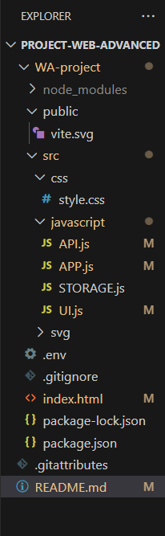
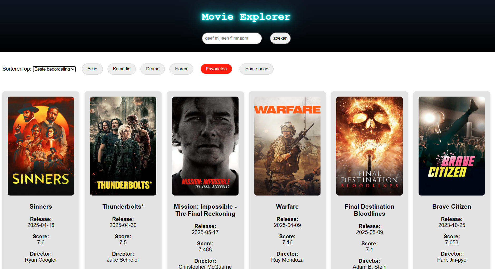
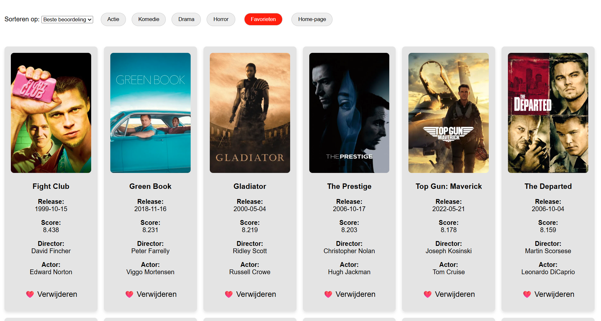
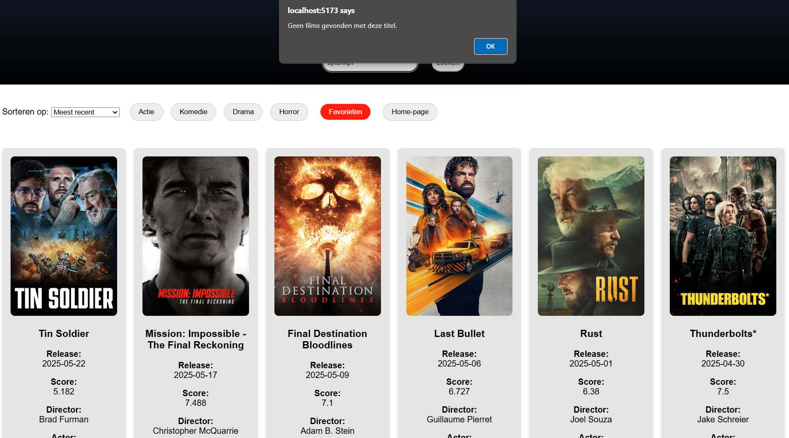
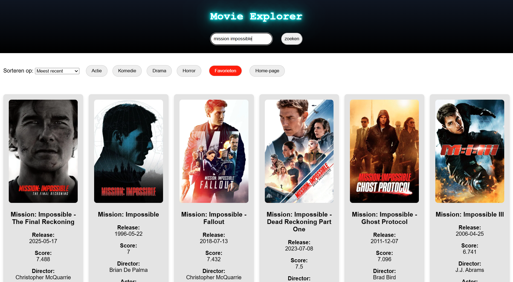
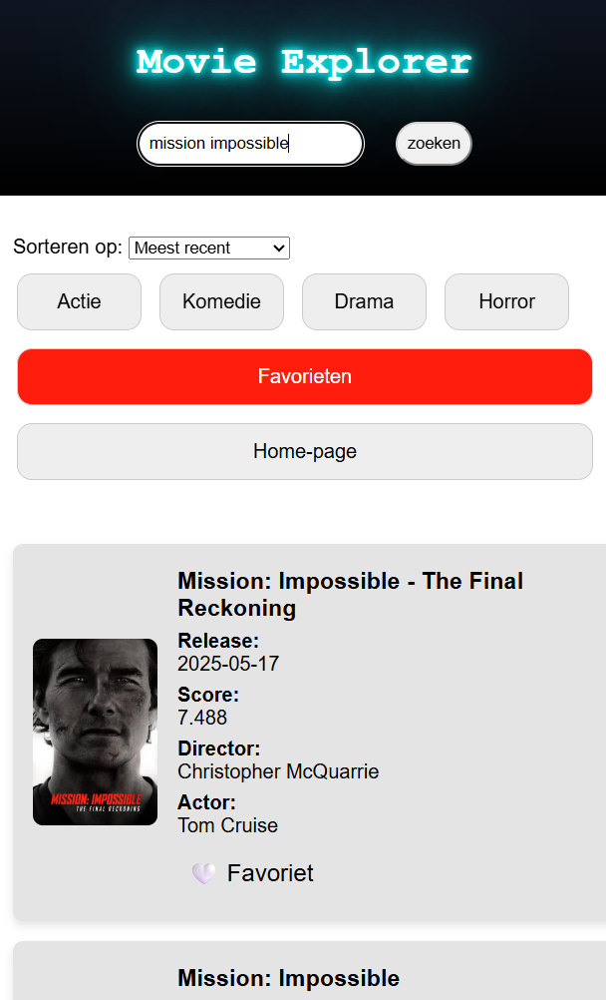

# Project Web Advanced
Eindproject voor het vak Web Advanced in het eerste jaar aan de Erasmushogeschool Brussel, schooljaar 2024-2025.

## 1 Projectbeschrijving

Deze single-page webapplicatie is gemaakt voor het vak Web Advanced. De app maakt gebruik van een externe API en biedt gebruikers de mogelijkheid om data te bekijken, filteren, sorteren en op te slaan in persoonlijke collecties (favorieten). De applicatie focust zich op een gebruiksvriendelijke ervaring met een responsief ontwerp.

## 1.1 Functionaliteiten

- **Data ophalen** van een externe API en visueel weergeven van data in een lijst- of kaartvorm
- **Zoekfunctie** films kunnen zoeken binnen de database
- **Filteren** op basis van verschillende film genre's zoals actie, komedie, drama en horror
- **Sorteren** op alfabetische volgorde, omgekeerde alfabetische volgorde, oudste, nieuwste en score
- **voorkeuren opslaan** voorbeelden zoals geolocatie, taalkeuze, themaswitcher, favorieten, gecachte API-data
- **Favorieten opslaan** die bewaard blijven tussen sessies via de `localStorage`
- **Responsive design** mobielvriendelijke weergave, door gebruik mediaquerie
- **Moderne interface** met duidelijke iconen, buttons en navigatie

## 2 Gebruikte API(s)

- The movie Database API ([https://developer.themoviedb.org/reference/intro/getting-started])

## 3 Technische Implementatie

### DOM-manipulatie
- Elementen selecteren
    src/javascript/APP.js → regel 5–10
    Via getElementById en querySelectorAll worden knoppen, formulieren en containers geselecteerd.

- Manipulatie van de DOM
    src/javascript/UI.js → regel 5–35
    Elementen worden dynamisch toegevoegd via innerHTML binnen renderMovies.

- Event listeners
    src/javascript/APP.js → regel 14–125
    Luistert naar submit, click, en change events voor zoeken, sorteren, genres en favorieten.
    src/javascript/UI.js → regel 37–55
    Behandelt click-events voor het toevoegen/verwijderen van favorieten.

### Modern JavaScript
- const en let
    Algemeen gebruikt voor scope-beheer, o.a. in API.js → regel 1–5.

- Template literals
    UI.js → regel 12
    Gebruikt voor het dynamisch genereren van HTML-inhoud van filmkaarten.

- Iteratie over arrays (forEach, map)
    UI.js → regel 6: movies.forEach(...)
    APP.js → regel 83: movies.map(...) voor enrichMoviesWithCredits

- Array-methoden (filter, map, sort)
    APP.js → regel 83: map
    APP.js → regel 131: filterByGenre gebruikt filter
    APP.js → regel 103: sortMovies gebruikt sort

- Arrow functions
    Veelvuldig gebruikt in alle bestanden voor beknopte functies.

- Ternary operator
    UI.js → regel 20 & 48
    Voor weergave van favoriete status: ❤️ vs 🤍

- Callback functions
    UI.js → regel 49: getMovieFromDOM(button) als helperfunctie binnen een eventlistener.

- Promises & async/await
    API.js → regel 6–30
    APP.js → regel 13–135
    Voor alle API-aanroepen en asynchrone verrijking van data (credits).

- Observer API
    APP.js → regel 139–160
    Gebruikt IntersectionObserver voor infinite scroll. Zodra de "scroll sentinel" zichtbaar is, wordt pagina 3+ dynamisch geladen en verrijkt.

### Data & API
- Data ophalen met fetch
    API.js → regels 6, 21, 39, 55
    Populaire films, genre-gebaseerde films, zoekopdrachten en credits worden opgehaald van The Movie Database (TMDb) API.

- JSON verwerken
    Direct na elke fetch wordt .json() aangeroepen om response-gegevens te verwerken.

- Data in DOM tonen
    UI.js → regel 5–35: renderMovies maakt en injecteert filmkaarten op basis van de opgehaalde data.

### Opslag & Validatie
- Gebruik van localStorage
    STORAGE.js → regel 4–29
    Favorieten worden opgeslagen, opgehaald, toegevoegd of verwijderd op basis van film-ID.

- Formuliervalidatie
    APP.js → regel 17–22
    Controleert of de zoekopdracht minimaal 2 tekens bevat. Bij onvoldoende input wordt de gebruiker gewaarschuwd.

### Styling & Layout
- CSS met Flexbox/Grid
    Gedefinieerd in src/css/style.css (niet gewijzigd). Lay-out is grid-gebaseerd (.movie-grid).

- UI-elementen
    Buttons voor genres, sorteren, favorieten, en zoekinvoer aanwezig in index.html en UI.js.

### Tooling & Structuur
- Build-tool
    Project is opgezet met Vite, wat snelle bundeling en module-ondersteuning biedt.

Folderstructuur:

## 4 Installatiehandleiding
Volg dit stappenplan om het project lokaal draaiende te krijgen op ([http://localhost:5173]).

1. Repository downloaden
- git clone https://github.com/QuintenLauwers2005/Project-Web-Advanced.git
   Waarom: Hiermee download je alle projectbestanden van GitHub naar je lokale computer.

2. Navigeer naar de map(WA-project)
    - cd WA-project
   Waarom: Je moet je in de juiste map bevinden om het project te kunnen installeren en draaien.

3. Verwijder oude installaties (oude modules en lock-bestanden)
    - rm -rf node_modules package-lock.json
   Waarom: Dit voorkomt mogelijke conflicten of fouten bij het installeren van packages.

4. Installeer de dependencies
    - npm install
   Waarom: Hiermee worden alle externe bibliotheken en tools gedownload die het project nodig heeft (zoals Vite en TMDB-integraties).

5. Start de Vite development server:
    - npm run dev
   Waarom: Hiermee start je de lokale server en kun je de website live bekijken op ([http://localhost:5173]).

## 5 screenshots van de applicatie

## 6 Gebruikte bronnen:
- gebruik chatGPT([https://chatgpt.com/share/682cb2f2-1d78-8000-be9b-88c222dc4c13])
- neon effect voor titel([https://youtu.be/MCmwxPIhwFE?si=uQYevyDF41d93hkI])
- inspiraties design([https://www.vidmore.com/video-playback/free-movie-websites/])
- infovideo als ik een onderdeel niet begreep van javascript DOM([https://youtu.be/IWRS_AM2fiE?si=STfHF2ieWdDpynER])
- Vite installatie([https://youtu.be/agpZsCUllqc?si=osKTl0Mj4Q8OvmdD])
- opstellen readMe chatGPT([https://chatgpt.com/share/682ce02b-e934-8000-a571-2b0b2e8e0a9f])